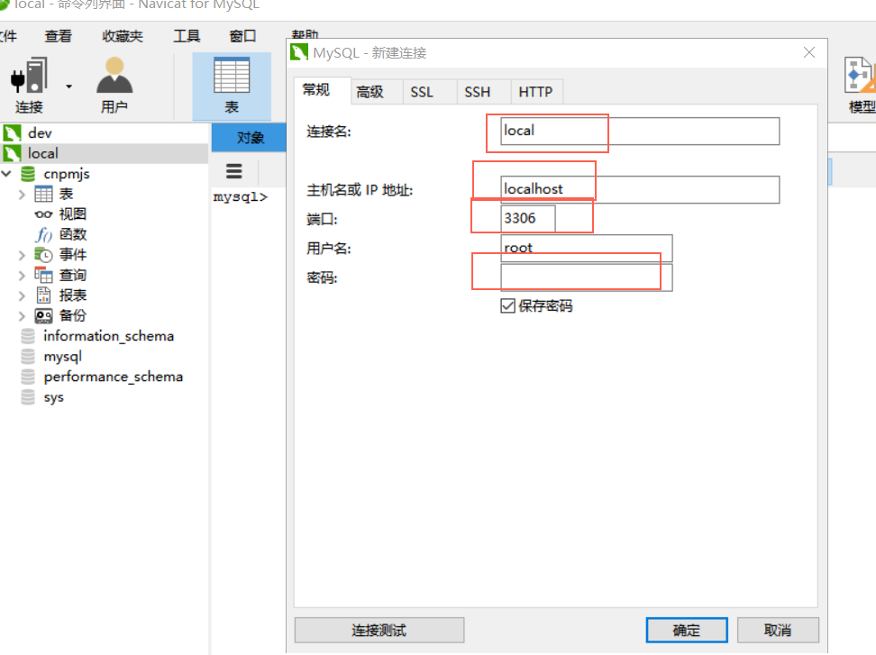
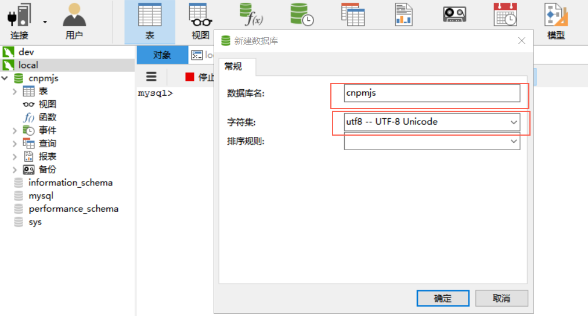
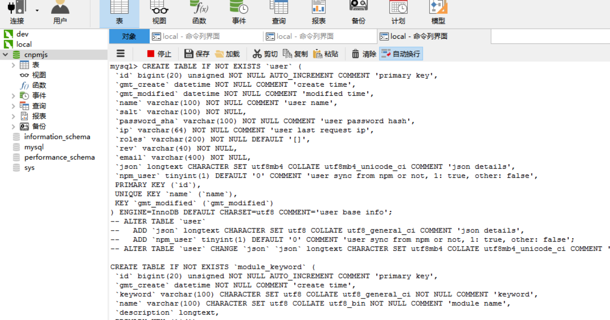
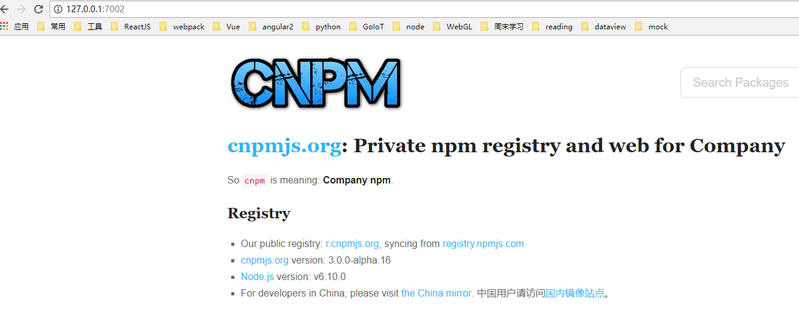
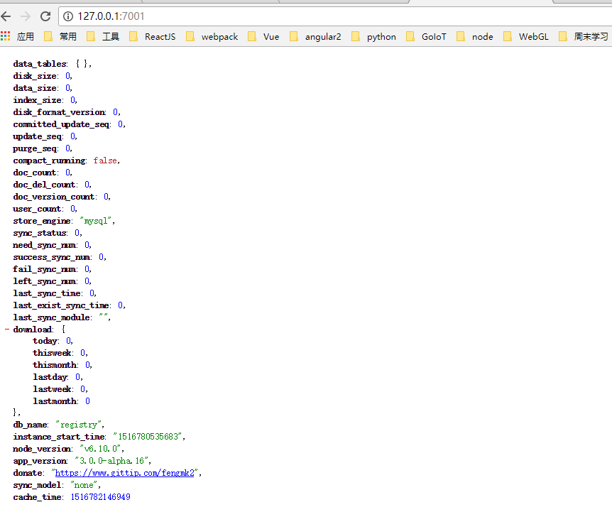
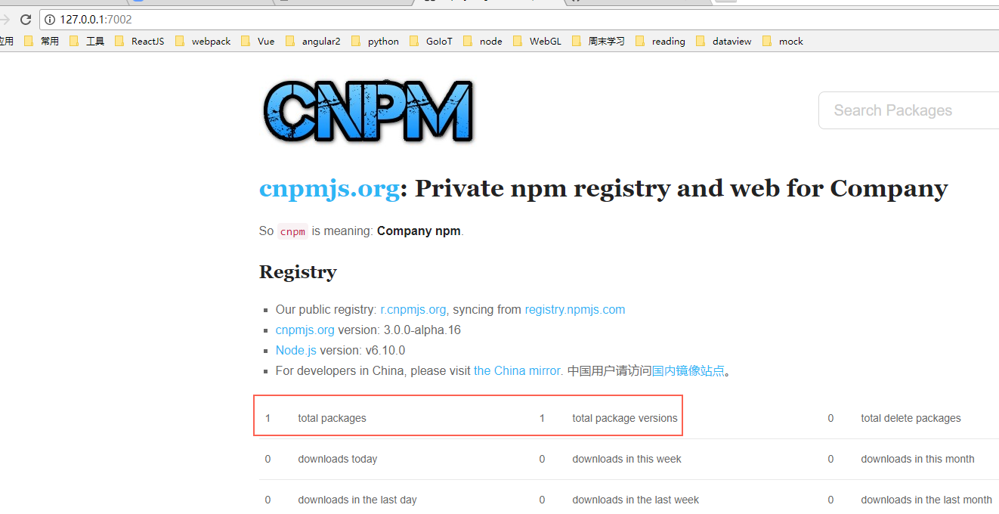
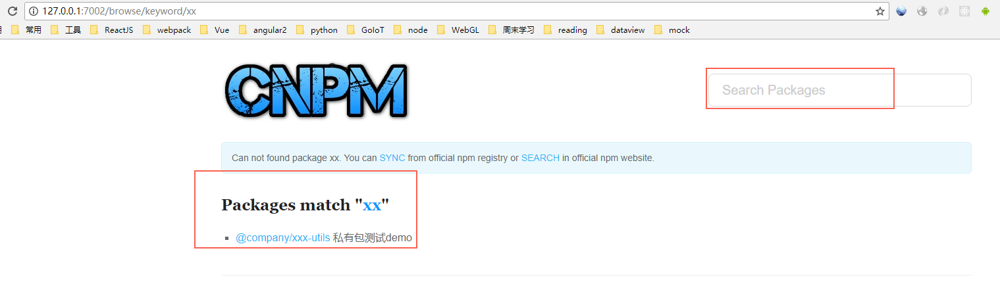
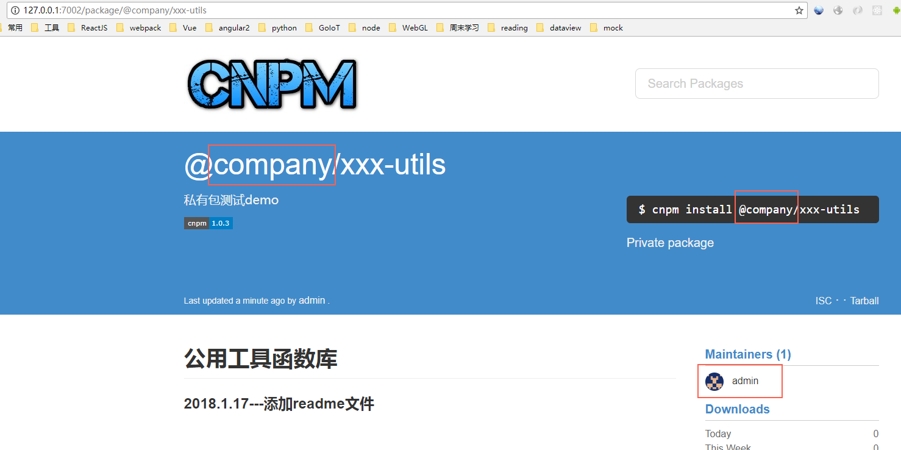

# 在window上测试安装cnpm私有仓库 

## 官方说明只能在linux和mac安装

### 1. clone到本地，安装dependencies

```bash
  # from git
  $ git clone https://github.com/cnpm/cnpmjs.org.git
  # 因为是在window上安装，所有官方文档上的一些命令就不能使用了，
  $ cd cnpmjs.org
  $ npm install
  $ npm run dev
```

上面的最后一条命令执行肯定是会报错的，下面我们就按着报错提示，一个一个的解决    
最终搭建自己完美的私有npm仓库

### 2. npm run dev报错

```bash
  D:\www\cnpmjs.org [master ≡ +0 ~1 -0 !]
  λ npm run dev

  > cnpmjs.org@3.0.0-alpha.16 dev D:\www\cnpmjs.org
  > DEBUG=cnpm* node dispatch.js

  'DEBUG' 不是内部或外部命令，也不是可运行的程序
  或批处理文件。

  npm ERR! Windows_NT 10.0.14393
  npm ERR! argv "C:\\Program Files\\nodejs\\node.exe" "C:\\Program Files\\nodejs\\node_modules\\npm\\bin\\npm-cli.js" "run" "dev" npm ERR! node v6.10.0
  npm ERR! npm  v3.10.10
  npm ERR! code ELIFECYCLE
  npm ERR! cnpmjs.org@3.0.0-alpha.16 dev: `DEBUG=cnpm* node dispatch.js`
  npm ERR! Exit status 1
```

  此命令错误主要是window不能执行`DEBUG=cnpm*`命令，所以我们要改这条命令
  更新package.json中命令如下，主要看`dev`命令

```json
{
  "scripts": {
    "dev": "set DEBUG=cnpm* & node dispatch.js",
    "test": "make jshint && make test",
    "test-local": "make test",
    "start": "./bin/nodejsctl start && cp History.md docs/web/history.md",
    "status": "./bin/nodejsctl status",
    "stop": "./bin/nodejsctl stop"
  }
}
```

再次执行`npm run dev`命令，已经不错了

```bash
  D:\www\cnpmjs.org [master ≡ +0 ~2 -0 !]
  λ npm run dev

  > cnpmjs.org@3.0.0-alpha.16 dev D:\www\cnpmjs.org
  > set DEBUG=cnpm* & node dispatch.js

  Starting cnpmjs.org ...
  cluster: false
  admins: {"fengmk2":"fengmk2@gmail.com","admin":"admin@cnpmjs.org","dead_horse":"dead_horse@qq.com"}
  scopes: ["@cnpm","@cnpmtest","@cnpm-test"]
  sourceNpmRegistry: https://registry.npm.taobao.org
  syncModel: none
  [Wed Jan 24 2018 14:52:05 GMT+0800 (中国标准时间)] [worker:34728] Server started, registry server listen at 127.0.0.1:7001, web
  listen at 127.0.0.1:7002, cluster: false

```

### 3. 我们根据提示访问`127.0.0.1:7002`，不用说又要报错了，但是页面应该是能访问的了

```bash
  cnpmjs.org:middleware:auth GET / with "" +0ms
  cnpmjs.org:middleware:auth GET /total with "" +416ms
{ SequelizeDatabaseError: SQLITE_ERROR: no such table: module
    at Query.formatError (D:\www\cnpmjs.org\node_modules\sequelize\lib\dialects\sqlite\query.js:348:14)
    at afterExecute (D:\www\cnpmjs.org\node_modules\sequelize\lib\dialects\sqlite\query.js:112:29)
    at replacement (D:\www\cnpmjs.org\node_modules\sqlite3\lib\trace.js:19:31)
    at Statement.errBack (D:\www\cnpmjs.org\node_modules\sqlite3\lib\sqlite3.js:16:21)
  name: 'SequelizeDatabaseError',
  message: 'SQLITE_ERROR: no such table: module',
  parent:
   { Error: SQLITE_ERROR: no such table: module
       at Error (native)
     errno: 1,
     code: 'SQLITE_ERROR',
     sql: 'SELECT count(name) AS count FROM module;' },
  original:
   { Error: SQLITE_ERROR: no such table: module
       at Error (native)
     errno: 1,
     code: 'SQLITE_ERROR',
     sql: 'SELECT count(name) AS count FROM module;' },
  sql: 'SELECT count(name) AS count FROM module;',
  url: '/total' }
SequelizeDatabaseError: SQLITE_ERROR: no such table: module
    at Query.formatError (D:\www\cnpmjs.org\node_modules\sequelize\lib\dialects\sqlite\query.js:348:14)
    at afterExecute (D:\www\cnpmjs.org\node_modules\sequelize\lib\dialects\sqlite\query.js:112:29)
    at replacement (D:\www\cnpmjs.org\node_modules\sqlite3\lib\trace.js:19:31)
    at Statement.errBack (D:\www\cnpmjs.org\node_modules\sqlite3\lib\sqlite3.js:16:21)
```

  这些错误的意思简单说就是没有database，没有table，什么都没有，怎么办  
  `// - currently supported: 'mysql', 'sqlite', 'postgres', 'mariadb'`  
  这是cnpmjs支持的数据库列表，默认使用sqlite，我准备使用mysql，所以安装mysql请百度

### 4. 因为我们是在window上跑这个项目，所以一些自动化命令我们就不能使用了

我们要手动执行sql语句，创建数据表，sql语句在`./docs/db.sql`  
为方便，使用navicat客户端工具（自己安装）

#### 4.1 连接mysql



#### 4.2 创建数据库cnpmjs(名字随便)

在mysql连接名字上比如`local`，右键->新建数据库



#### 4.3 执行sql

在数据库`cnpmjs`名字上右键->命令行界面，将`./docs/db.sql`中的sql语句进行copy，  
粘贴到命令，回车执行ok。  
特别注意有个`./docs/user.sql`，必须单独执行一下



#### 4.4 修改配置文件`config/index.js`

主要配置`db`, `username`, `password`, `dialect`, `host`, `port`

```js
  /**
   * database config
   */

  database: {
    db: 'cnpmjs',
    username: 'root',
    password: 'root',

    // the sql dialect of the database
    // - currently supported: 'mysql', 'sqlite', 'postgres', 'mariadb'
    dialect: 'mysql',

    // custom host; default: 127.0.0.1
    host: '127.0.0.1',

    // custom port; default: 3306
    port: 3306,

    // use pooling in order to reduce db connection overload and to increase speed
    // currently only for mysql and postgresql (since v1.5.0)
    pool: {
      maxConnections: 10,
      minConnections: 0,
      maxIdleTime: 30000
    },

    // the storage engine for 'sqlite'
    // default store into ~/.cnpmjs.org/data.sqlite
    storage: path.join(dataDir, 'data.sqlite'),

    logging: !!process.env.SQL_DEBUG,
  },
```

### 5. 重新启动项目`npm run dev`，现在应该一切正常了



7001验证


### 6. 现在到了我们怎么使用私有库的时候了

#### 6.1 我们使用`nrm`这个模块进行npm库的管理

```bash
  #
  $ npm install nrm -g

  $ nrm ls

  # npm ---- https://registry.npmjs.org/
  # cnpm --- http://r.cnpmjs.org/
  # * taobao - https://registry.npm.taobao.org/
  # nj ----- https://registry.nodejitsu.com/
  # rednpm - http://registry.mirror.cqupt.edu.cn/
  # npmMirror  https://skimdb.npmjs.com/registry/
  # edunpm - http://registry.enpmjs.org/
```

上面可以看出可以用的npm仓库地址，`*`标明当前使用的仓库地址，使用`npm use 'name'`切换仓库

#### 6.2 添加本地私有仓库

cnpm提供两个端口：7001和7002，其中7001用于NPM的注册服务，7002用于Web访问

```bash
  $ nrm add local http://127.0.0.1:7001/

    add registry local success

  $ nrm ls

  # npm ---- https://registry.npmjs.org/
  # cnpm --- http://r.cnpmjs.org/
  # * taobao - https://registry.npm.taobao.org/
  # nj ----- https://registry.nodejitsu.com/
  # rednpm - http://registry.mirror.cqupt.edu.cn/
  # npmMirror  https://skimdb.npmjs.com/registry/
  # edunpm - http://registry.enpmjs.org/
  # local -- http://127.0.0.1:7001/
```

local就是我们刚才添加的本地私有npm仓库，执行

```bash
  nrm use local
  # 使用本地仓库
```

#### 6.3 发布npm包

在发布 npm 包之前，需要先将原先的 config/config.js 中添加一些配置属性：

```js
  enablePrivate: true, // 只有管理员可以发布 npm 包，默认为 false，即任何人都可以发布包
  admins: {
    admin: 'admin@admin.com' // 管理员权限
  },
  scopes: ['@company'], // 私有包必须依附于 scope 下
```

登录我们配置的管理员

```bash
  # 使用本地仓库
  nrm use local
   Registry has been set to: http://127.0.0.1:7001/
  # 执行登录
  npm login
  Username: admin     # 输入用户名
  Password:           # 密码admin
  Email: (this IS public) admin@admin.com     # 邮箱就是配置的邮箱
    Logged in as admin on http://127.0.0.1:7001/.
```

我们知道，要发布包到npm，需要有github仓库地址，现在我们就在github上建个demo作测试  
实际使用应该使用公司内部的gitlab

我们直接使用已有的[demo](https://github.com/twolun/xxx-utils)

```bash
  git clone git@github.com:twolun/xxx-utils.git
  cd xxx-utils
  npm publish
    + @evcard/evcard-utils@1.0.2
    # 应该是发布成功
```

1.下面我们在仓库中查看，已经有了一个包了



2.这上面只有通过搜索才能查看到发布的包



3.进一步查看，注意我画红线的部分，是在`config/index.js`里配置的



4.最后一点要注意，就是我们发布包的`package.json`文件里有包名的写法  
  尤其注意name的写法`@company`也是固定的，与`config/index.js`里的配置相对应

```json
{
  "name": "@company/xxx-utils",
  "version": "1.0.3",
  "description": "私有包测试demo",
  "main": "index.js",
  "scripts": {
    "test": "echo \"Error: no test specified\" && exit 1"
  },
  "author": "admin@admin.com",
  "license": "ISC"
}
```

#### 6.4 安装本地仓库刚刚发布的`xxx-utils`包

```bash
  D:\github\fis3-parser-html-plugin1
  npm install @company/xxx-utils -S
  fis3-parser-html-plugin@1.0.0 D:\github\fis3-parser-html-plugin1
    `-- @company/xxx-utils@1.0.3

  npm WARN fis3-parser-html-plugin@1.0.0 No repository field.
```

到此安装成功，应该可以使用了

## 总结

  1. 全程window环境，相信在mac, linux环境肯定也没问题的  
  2. sql语句手动执行，创建database和table  
  3. 更改相关配置一切搞定  
  4. 全程没有使用cnpm这个，使用更方便nrm来切换仓库池  
  5. 更多详细配置请查看cnpmjs.org官方文档

[完整demo地址](https://github.com/twolun/window-cnpmjs)  
[xxx-utils地址](https://github.com/twolun/xxx-utils)
